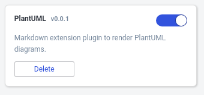

# Joplin Plugin - PlantUML

This plugin allows you to create UML diagrams uing the syntax defined in [https://plantuml.com](https://plantuml.com).

# Install the plugin

### Automatic installation

Use the Joplin plugin manager to install it:

- Start Joplin app
- Go to `Options > Plugins`
- Input `plantuml` to `Search for plugins` text field.
- `Install`
- Restart Joplin



### Manual installation

- Download the last release from this repository.
- Open `Joplin > Options > Plugins > Install from File`
- Select the jpl file you downloaded.

# Markdown syntax

Use the markdown fence syntax to create a new PlantUML diagram.

Syntax example:

    ```plantuml
    @startuml
    Alice -> Bob: Authentication Request
    Bob --> Alice: Authentication Response

    Alice -> Bob: Another authentication Request
    Alice <-- Bob: Another authentication Response
    @enduml
    ```

Rendering example:


# Development

If you want to contribute to this plugin you can find here some userful references:

- [Joplin - Getting started with plugin development](https://joplinapp.org/api/get_started/plugins/)
- [Joplin - Plugin API reference](https://joplinapp.org/api/references/plugin_api/classes/joplin.html)
- [Joplin - Data API reference](https://joplinapp.org/api/references/rest_api/)
- [Joplin - Plugin examples](https://github.com/laurent22/joplin/tree/dev/packages/app-cli/tests/support/plugins)