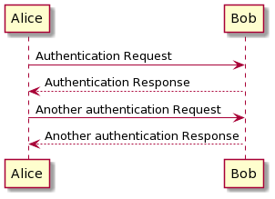
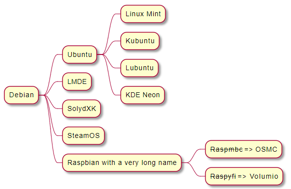
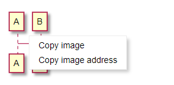
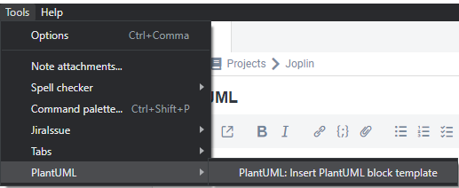
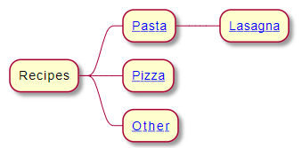
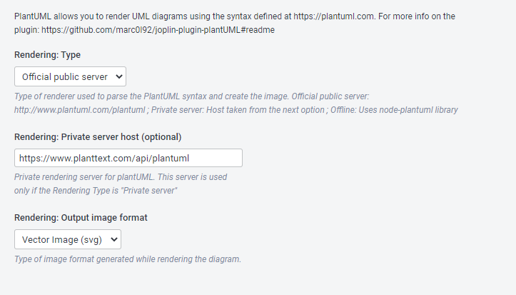

# Joplin Plugin - PlantUML2

> WARNING: I moved my notes to Obsidian.md and I will not provide additional support to this plugin.
> Pull request are welcome.

This plugin allows you to create UML diagrams using the syntax defined in [https://plantuml.com](https://plantuml.com).

<!-- TOC -->

- [Joplin Plugin - PlantUML2](#joplin-plugin---plantuml2)
    - [Install the plugin](#install-the-plugin)
        - [Automatic installation](#automatic-installation)
        - [Manual installation](#manual-installation)
- [Markdown syntax](#markdown-syntax)
    - [Sequence Diagram Example](#sequence-diagram-example)
    - [MindMap Diagram Example](#mindmap-diagram-example)
- [Other functionalities](#other-functionalities)
    - [Context menu](#context-menu)
    - [Menu shortcuts](#menu-shortcuts)
    - [Links to other notes](#links-to-other-notes)
    - [Options](#options)
    - [Extra hints](#extra-hints)
- [Known issues](#known-issues)
    - [Rendering of math formulas](#rendering-of-math-formulas)
- [Development](#development)

<!-- /TOC -->

<a href='https://ko-fi.com/marc0l92' target='_blank'></a>

## Install the plugin

### Automatic installation

Use the Joplin plugin manager to install it (`Joplin > Options > Plugins`).
Search for `PlantUML2`.


### Manual installation

- Download the last release from this repository.
- Open `Joplin > Options > Plugins > Install from File`
- Select the jpl file you downloaded.

# Markdown syntax

Use the markdown fence syntax to create a new PlantUML diagram.
Inside this block you can use the syntax documented at [https://plantuml.com](https://plantuml.com).

## Sequence Diagram Example

Syntax example:

    ```plantuml
    @startuml
    Alice -> Bob: Authentication Request
    Bob --> Alice: Authentication Response

    Alice -> Bob: Another authentication Request
    Alice <-- Bob: Another authentication Response
    @enduml
    ```

Rendering example:



## MindMap Diagram Example

Syntax example:

    ```plantuml
    @startmindmap
    * Debian
    ** Ubuntu
    *** Linux Mint
    *** Kubuntu
    *** Lubuntu
    *** KDE Neon
    ** LMDE
    ** SolydXK
    ** SteamOS
    ** Raspbian with a very long name
    *** <s>Raspmbc</s> => OSMC
    *** <s>Raspyfi</s> => Volumio
    @endmindmap
    ```

Rendering example:



# Other functionalities

## Context menu
Use the context menu (mouser right click) on the rendered diagram to copy the image or the url.



## Menu shortcuts
If you don't remember the syntax to create a PlantUML diagram you can use the templates in the tools menu



## Links to other notes
You can create links to other notes inside the PlantUML diagram using the link `joplin://<noteid>`. This feature is only available when the rendering format `Vector Image (svg)` is selected.

Example:

    ```plantuml
    @startmindmap
    * Recipes
    ** [[joplin://983de92ea39448a19e7c9a9b7c797bb0 Pasta]]
    *** [[joplin://fdb2b25f0ec14864ba65c26a42404bb9 Lasagna]]
    ** [[joplin://e3880d97001546c79f1dc3584cc6b30d Pizza]]
    ** [[https://www.giallozafferano.com Other]]
    @endmindmap
    ```



## Options
Use the plugin's options to define the rendering server and the output format.



## Extra hints
- The tag name is case insensitive
- This plugin is not compatible with WYSIWYG editor
- In order to make the diagram visible while exporting the note, an image cache is created on disk. The cache is located at ${temp}/joplin-plantUml2-plugin/

# Known issues

List of plantUml rendering issues that cannot be solved because not related to this plugin but to the official server.

## Rendering of math formulas

**Code**: [#3](https://github.com/marc0l92/joplin-plugin-plantUML/issues/3)

**Problem**: Latex math formulas cannot be rendered as svg images

**Example**:
```
@startuml
skinparam handwritten true
:<math>int_0^1f(x)dx</math>;
:<math>x^2+y_1+z_12^34</math>;
note right
Try also
<math>d/dxf(x)=lim_(h->0)(f(x+h)-f(x))/h</math>
<latex>P(y|\mathbf{x}) \mbox{ or } f(\mathbf{x})+\epsilon</latex>
end note
@enduml
```

**Workaround**: Modify in the plugin options the rendering mode to `Raster image (png)`

# Development
If you want to contribute to this plugin you can find here some useful references:

- [Joplin - Getting started with plugin development](https://joplinapp.org/api/get_started/plugins/)
- [Joplin - Plugin API reference](https://joplinapp.org/api/references/plugin_api/classes/joplin.html)
- [Joplin - Data API reference](https://joplinapp.org/api/references/rest_api/)
- [Joplin - Plugin examples](https://github.com/laurent22/joplin/tree/dev/packages/app-cli/tests/support/plugins)
